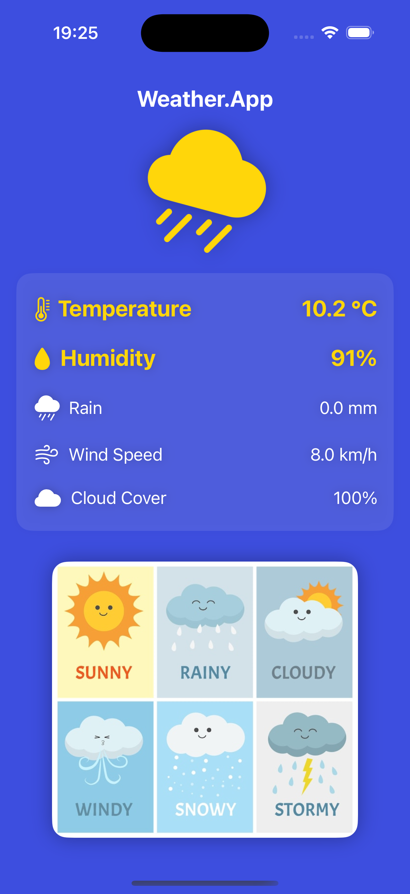

# Weather.App-SwiftUI

## Structure

├── Managers
│ ├── LocationManager # Get current coordinate
│ ├── WeatherManager # Fetch API to get the weather
├── Views # Unit tests
│ ├── LoadingView # Circle processing UI
│ ├── WeatherDataView # Show all weather fields
│ ├── WeatherDetailRowView # Details of one field
│ ├── WelcomeView # Request to get coordinates
├── Models # Unit tests
│ ├── WeatherModel # Open-weather
├── README.md

## Screens

  
  
  

